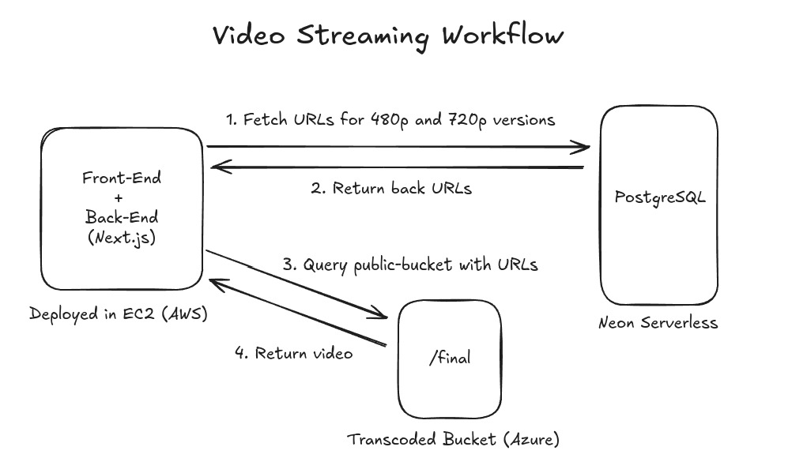
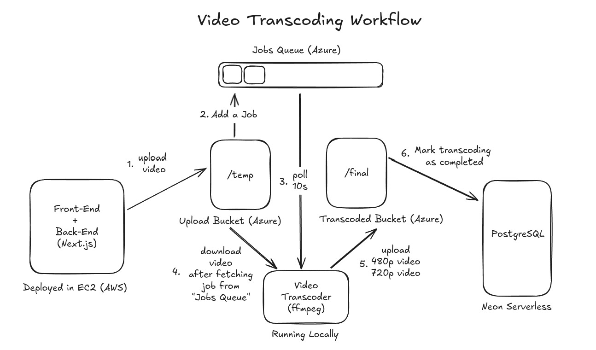

# Video Transcoding (Cloud Project)

This repository contains a learning management platform which allows educators
to upload videos that get transcoded into 480p and 720p resolutions and are 
made available to students without the necessity of any login.

The repository is split into the following parts:

1. `platform` - Full-stack application (Next.js)
2. `pipeline` - Video Transcoding Pipeline (ffmpeg)
3. `workers` - Azure Functions for Event Driven Triggers

## System Design

## Team Mates
- [Ritesh Koushik (CB.EN.U4CSE22038)](https://github.com/IAmRiteshKoushik/)
- [Santanu Jha (CB.EN.U4CSE22351)](https://github.com/CraftsmanSJ/)
- [Ehtesham Ali Haidar (CB.EN.U4CSE22511)](https://github.com/Ehteshamalihaidar/)
